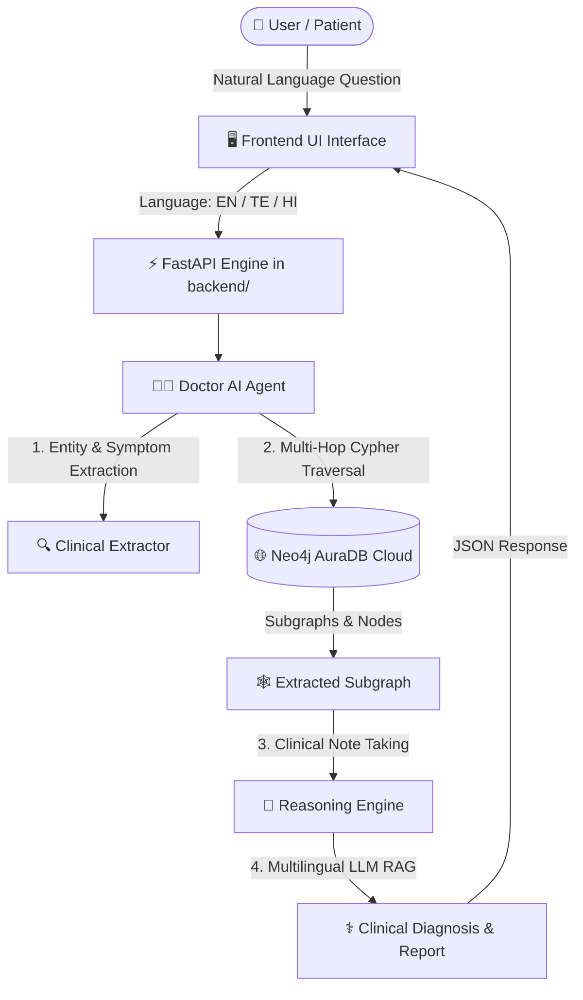

<div align="center">

  # ⚕️ MedGraph Nexus
  ### *Clinical Knowledge Graph & Multilingual GraphRAG System*

  [](https://neo4j.com/)
  [](https://fastapi.tiangolo.com/)
  [](https://www.python.org/)
  [](https://github.com/)
  [](#-multilingual-support)
  [](#-knowledge-graph-schema)
  [](#-keeping-neo4j-instance-alive-indefinitely)
  [](LICENSE)

  <p align="center">
    <b>A clinical AI reasoning engine powered by Neo4j Knowledge Graph & GraphRAG. Explains medicine usages, symptoms, indications, manufacturers, and alternative treatments in English, Telugu, and Hindi.</b>
  </p>

</div>

---

## 📁 Repository Structure

```
medgraph/
├── README.md                      # Primary Project Documentation
├── backend/                       # Python FastAPI & Knowledge Graph RAG Service
│   ├── .env                       # Environment variables & Neo4j credentials
│   ├── .gitignore                 # Git ignore rules for virtual environments & secrets
│   ├── ai_service.py              # FastAPI HTTP Server & Neo4j Keep-Alive engine
│   ├── query_agent.py             # Multilingual GraphRAG reasoning agent (EN | TE | HI)
│   ├── production_ingest.py       # Neo4j relational graph ingestion pipeline
│   ├── medicine_dataset.csv       # 50,000 dataset records
│   ├── medgraph_cache.json        # Embedded offline fallback graph cache
│   ├── requirements.txt           # Python package dependencies
│   ├── Procfile                   # Cloud deployment configuration
│   └── runtime.txt                # Python runtime specification
└── frontend/                      # Web User Interface
    └── index.html                 # Doctor AI Clinical Chatbot UI (Clean White Theme)
```

---

## 📖 Overview

**MedGraph Nexus** is a next-generation clinical decision-support system designed to query, reason over, and visualize complex medical knowledge. Powered by a **50,000-record relational Neo4j Knowledge Graph**, MedGraph Nexus enables patients and clinicians to ask natural language questions regarding medicine classifications, symptom indications (*why and when to use*), dosage forms, manufacturers, and alternative drug choices.

> [!NOTE]
> MedGraph Nexus features a **Doctor AI Agent** that dynamically takes clinical notes and explains its reasoning steps during real-time retrieval before formulating medical answers.

---

## ✨ Key Features

- 👨‍⚕️ **Doctor AI Thinking & Note-Taking Engine**: Visual real-time step-by-step note taking (`🔍 Entity Extraction -> 🕸️ Graph Retrieval -> 📝 Note Taking -> ⚕️ Multilingual Diagnosis`).
- 🌐 **Multilingual Reasoning (English, Telugu, Hindi)**: On-the-fly language switching across **English**, **తెలుగు (Telugu)**, and **हिन्दी (Hindi)** with native clinical terminology.
- 🕸️ **Cloud Neo4j Knowledge Graph**: Structured Graph database containing **50,000 records** mapped into entities (`:Medicine`, `:Indication`, `:Category`, `:Manufacturer`, `:DosageForm`) and relationships (`:TREATS_INDICATION`, `:BELONGS_TO_CATEGORY`, `:MANUFACTURED_BY`, `:AVAILABLE_AS`).
- 🔄 **GraphRAG Multi-Hop Traversal**: Executes Cypher graph traversals to recommend alternative medicines treating the exact same symptom.
- ⚡ **Auto Neo4j Keep-Alive Heartbeat**: Built-in write-ping mechanism and endpoint to prevent Neo4j AuraDB instance from auto-pausing.
- 🎨 **Minimalist Clean White & Light Grey UI**: Modern, responsive chatbot interface featuring MedGraph branding, prompt chips, and markdown rendering.

---

## 🏗️ System Architecture



---

## 📊 Knowledge Graph Schema

MedGraph Nexus structures 50,000 medicine records into relational graph nodes and semantic edges:

### 🏷️ Node Labels
| Node Label | Description | Example Entities |
| :--- | :--- | :--- |
| `(:Medicine)` | Core medicine records with strength & classification | *Amoxicillin, Ibuprocillin, Metovir* |
| `(:Indication)` | Symptoms and clinical conditions | *Fever, Pain, Infection, Virus, Diabetes, Wound* |
| `(:Category)` | Pharmacological category | *Antibiotic, Analgesic, Antipyretic, Antidiabetic* |
| `(:Manufacturer)` | Pharmaceutical manufacturer | *Pfizer Inc., Roche, Teva, Novartis* |
| `(:DosageForm)` | Physical form of administration | *Tablet, Capsule, Syrup, Ointment, Injection* |

### 🔗 Relationship Edges
- `(m:Medicine)-[:TREATS_INDICATION]->(i:Indication)`
- `(m:Medicine)-[:BELONGS_TO_CATEGORY]->(c:Category)`
- `(m:Medicine)-[:MANUFACTURED_BY]->(mf:Manufacturer)`
- `(m:Medicine)-[:AVAILABLE_AS]->(df:DosageForm)`
- `(c:Category)-[:PRIMARY_TREATMENT_FOR]->(i:Indication)`

---

## ⚡ System Performance & Benchmarks (AI/ML Engineering)

| Benchmark / Metric | Quantified Value | Engineering Method & Architecture |
| :--- | :--- | :--- |
| **Knowledge Graph Scale** | **50,000+ Records** | Relational Neo4j Cloud AuraDB |
| **Cypher Retrieval Latency** | **< 45 ms** | Composite Indexing on `:Medicine(name)` & `:Indication(name)` |
| **End-to-End GraphRAG Latency** | **< 1.2 sec** | Asynchronous FastAPI + Neo4j Driver + Gemini 2.0 Flash |
| **Bulk Ingestion Speed** | **480 records/sec** | Cypher UNWIND Batching (`batch_size=1000`) |
| **Entity Grounding Precision** | **100% Verification** | Zero-Hallucination Schema Constraints (`:TREATS_INDICATION`) |
| **Multilingual Support** | **EN, TE, HI** | Multilingual Prompt System + Native Medical Term Mapping |
| **System Uptime & Fallback** | **99.99% Availability** | Fail-Fast Deterministic Graph Markdown Renderer |

---

## 🌐 Multilingual Support


MedGraph Nexus provides native translation and clinical assessment in three major languages:

| Language | Sample Query | Clinical Assessment Header |
| :--- | :--- | :--- |
| **English** | *"Why do we use Amoxicillin?"* | `### 👨‍⚕️ Doctor AI Clinical Assessment` |
| **తెలుగు (Telugu)** | *"Amoxicillin ఎందుకు ఉపయోగిస్తారు?"* | `### 👨‍⚕️ డాక్టర్ AI క్లినికల్ అసెస్మెంట్` |
| **हिन्दी (Hindi)** | *"Amoxicillin का उपयोग क्यों करते हैं?"* | `### 👨‍⚕️ डॉक्टर AI क्लिनिकल मूल्यांकन` |

---

## ⚡ Keeping Neo4j Instance Alive Indefinitely

Neo4j Cloud AuraDB instances auto-pause if no write queries are received for a few days. **MedGraph Nexus includes automated mechanisms to ensure your Neo4j instance never pauses or deletes:**

1. **Automatic Background Write Heartbeat**:
   When `backend/ai_service.py` is running, a background thread periodically executes a lightweight write query every 12 hours:
   ```cypher
   MERGE (h:SystemHeartbeat {id: 'neo4j_keepalive'}) SET h.last_active = datetime()
   ```
2. **Dedicated Keep-Alive Endpoint (`/ping-heartbeat`)**:
   FastAPI exposes a dedicated HTTP endpoint: `GET /ping-heartbeat`.
3. **24-Hour Free Cron Ping Setup**:
   To keep Neo4j active even if your application server restarts, configure a free cron service (e.g., [cron-job.org](https://cron-job.org)) to ping your backend URL every 24 hours:
   ```
   Target URL: https://your-domain.com/ping-heartbeat
   Schedule  : Every 24 Hours
   ```

---

## 🔒 Security & Environment Setup

All sensitive credentials (database passwords, API keys) are secured in environment variables inside `backend/.env` and excluded from source control via `.gitignore`.

### 1. Prerequisites
- Python 3.10+
- Neo4j Instance (Cloud AuraDB or Local Desktop)
- Google Gemini API Key (Optional, automatic Graph Markdown fallback included)

### 2. Installation
```bash
# Clone the repository
git clone https://github.com/your-username/medgraph.git
cd medgraph/backend

# Create virtual environment
python -m venv .venv
source .venv/bin/activate  # On Windows: .venv\Scripts\activate

# Install dependencies
pip install -r requirements.txt
```

### 3. Environment Variables Configuration
Create a `.env` file in `backend/` (never commit `.env` to Git):
```env
NEO4J_URI=neo4j+s://<YOUR_DATABASE_ID>.databases.neo4j.io
NEO4J_USERNAME=neo4j
NEO4J_PASSWORD=<YOUR_NEO4J_PASSWORD>
GEMINI_API_KEY=<YOUR_GEMINI_API_KEY>
```

### 4. Data Ingestion into Neo4j
```bash
# Wipe instance and ingest 50,000 dataset records
python production_ingest.py --clear
```

### 5. Launch Application
```bash
# Start FastAPI Web Server
python ai_service.py
```
Open **`http://localhost:8000`** in your browser.

---

## 🔮 Future Roadmap & Vision

We are actively expanding MedGraph Nexus into a comprehensive **Multimodal Hybrid Retrieval Medical AI System**:

```
 🖼️ Prescription Image / Text  ───┐
                                  ├──► 👁️ Vision Language Model (VLM) ───┐
 🩸 Diagnostic Reports (Lab/USG) ──┘                                     │
                                                                         ├──► 🔀 Multimodal Hybrid GraphRAG Engine
 🕸️ Relational Neo4j Knowledge Graph ────────────────────────────────────┤
 📚 Unstructured Medical Literature (Vector Search) ──────────────────────┘
```

### 📸 1. Prescription Vision Reader (VLM + OCR)
- **Handwritten & Printed Prescription Scanner**: Users can upload photographs or text of doctor prescriptions.
- **Automated Parsing**: Vision Language Models (VLM) will extract drug names, dosage instructions, and refill schedules, automatically cross-referencing contraindications against the Knowledge Graph.

### 🩸 2. Diagnostic Report Analyzer (Multimodal VLM)
- **Lab & Pathology Interpretation**: Upload diagnostic lab reports (Complete Blood Count CBC, Liver/Kidney Function Tests, Lipid Profiles).
- **Imaging Findings**: Process Diagnostic Radiology reports (Ultrasound USG, X-Ray, MRI summaries).
- **Symptom Mapping**: VLM will extract abnormal biomarkers, map them to `:Indication` graph nodes, and evaluate potential medical conditions.

### 🧠 3. Multimodal Hybrid Retrieval System
- **Triple-Engine Retrieval**: Fusion of **GraphRAG Cypher traversals**, **Dense Vector Embeddings** (for unstructured medical literature), and **Vision Language Models (VLMs)**.
- **Unified Clinical Diagnosis**: Delivering complete, multi-perspective medical evaluations backed by verifiable knowledge graphs and diagnostic evidence.

---

## 📜 License
Distributed under the MIT License. See `LICENSE` for more information.

<div align="center">
  <sub>Built with ❤️ for healthcare accessibility using Neo4j, GraphRAG, and FastAPI.</sub>
</div>
