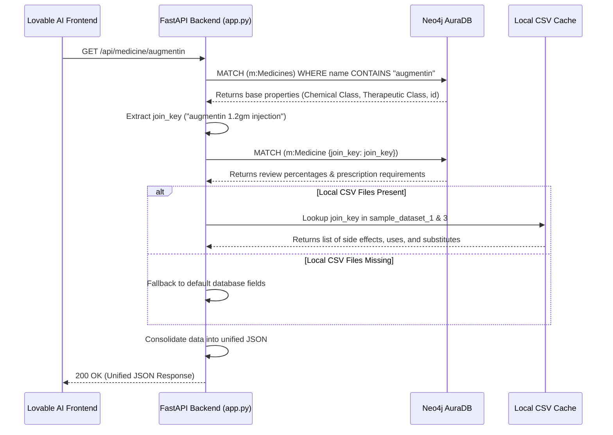

# MedGraph AI Backend Service

Welcome to the **MedGraph AI Backend Service** repository. This service acts as a high-performance REST API gateway connecting your **Lovable AI Frontend** to your **Neo4j AuraDB Graph Database** (containing 51,000+ nodes). 

This backend is designed for clean containerization, local execution, and effortless cloud deployment (e.g., Google Cloud Run).

---

## 1. System Architecture

To ensure 100% data reliability, the service implements a **hybrid query engine**. The backend connects to Neo4j to find matching medicine nodes, and dynamically merges their attributes with local CSV datasets (containing side effects, substitutes, and uses) if present. This allows for rich data retrieval even if the graph relationships are still being built in the database.

### Query Retrieval Workflow



---

## 2. Repository Contents

This deployment folder contains exactly the necessary files for backend setup and deployment:

* **`app.py`:** Consolidated Python script containing the database retriever client, CSV fallback logic, and all FastAPI REST endpoints.
* **`requirements.txt`:** Package definition list containing `fastapi`, `uvicorn`, `neo4j`, `python-dotenv`, and `pandas`.
* **`Dockerfile`:** Blueprint for building the Docker image and deploying it to Google Cloud Run or App Engine.
* **`.env`:** Local configuration containing your Neo4j instance URL, username, and password (ignored by Git for security).
* **`.gitignore`:** Simple file instructing Git to ignore `.env` so passwords are never pushed to GitHub.
* **`architecture_diagram.png`:** Visual system architecture flowchart.

---

## 3. API Endpoints

The API is fully CORS-enabled, allowing your Lovable AI frontend to fetch data directly:

| Endpoint | Method | Params | Description |
| :--- | :---: | :--- | :--- |
| `/` | `GET` | None | Health check and database connection status. |
| `/api/medicine/{name}` | `GET` | `name` (Path) | Get detailed properties, side effects, and uses of a medicine. |
| `/api/substitutes/{name}` | `GET` | `name` (Path) | Fetch brand alternatives/substitute drugs. |
| `/api/substitutes/safe` | `GET` | `name` (Query), `avoid` (Query) | Find substitutes that do NOT trigger specific side effects. |
| `/api/search` | `GET` | `use` (Query), `limit` (Query) | Search medicines by symptoms or indications (e.g. Cough). |
| `/api/query` | `POST` | Body: `{ "query": "...", "parameters": {} }` | Exposes a portal to execute custom Cypher statements. |

---

## 4. Setup & Installation

### Local Manual Start

1. **Activate Virtual Environment:**
   ```bash
   python -m venv venv
   # On Windows:
   .\venv\Scripts\Activate.ps1
   # On macOS/Linux:
   source venv/bin/activate
   ```

2. **Install Dependencies:**
   ```bash
   pip install -r requirements.txt
   ```

3. **Configure Environment variables:**
   Create a `.env` file in the folder root:
   ```ini
   NEO4J_URI=neo4j+s://<your-instance-id>.databases.neo4j.io
   NEO4J_USERNAME=<your-username>
   NEO4J_PASSWORD=<your-password>
   NEO4J_DATABASE=<your-db-name>
   ```

4. **Start the server:**
   ```bash
   uvicorn app:app --reload
   ```
   Open [http://127.0.0.1:8000/docs](http://127.0.0.1:8000/docs) in your browser to view the interactive API playground.

---

## 5. Dockerization & Cloud Deployment

### Run Locally with Docker

1. **Build the container:**
   ```bash
   docker build -t medgraph-backend .
   ```

2. **Run the container:**
   Pass env variables directly during runtime to keep your secrets safe:
   ```bash
   docker run -p 8080:8080 \
     -e NEO4J_URI="neo4j+s://<your-instance-id>.databases.neo4j.io" \
     -e NEO4J_USERNAME="<your-username>" \
     -e NEO4J_PASSWORD="<your-password>" \
     -e NEO4J_DATABASE="<your-db-name>" \
     medgraph-backend
   ```
   The application will be online at `http://localhost:8080`.

### Deploy to Google Cloud Run

To deploy directly to Google Cloud using the Google Cloud SDK:

```bash
# Submit build to Container Registry
gcloud builds submit --tag gcr.io/your-project-id/medgraph-backend

# Deploy the image to Cloud Run (automatically handles HTTP port routing)
gcloud run deploy medgraph-backend \
  --image gcr.io/your-project-id/medgraph-backend \
  --platform managed \
  --region us-central1 \
  --allow-unauthenticated \
  --set-env-vars NEO4J_URI="neo4j+s://<your-instance-id>.databases.neo4j.io",NEO4J_USERNAME="<your-username>",NEO4J_PASSWORD="<your-password>",NEO4J_DATABASE="<your-db-name>"
```
