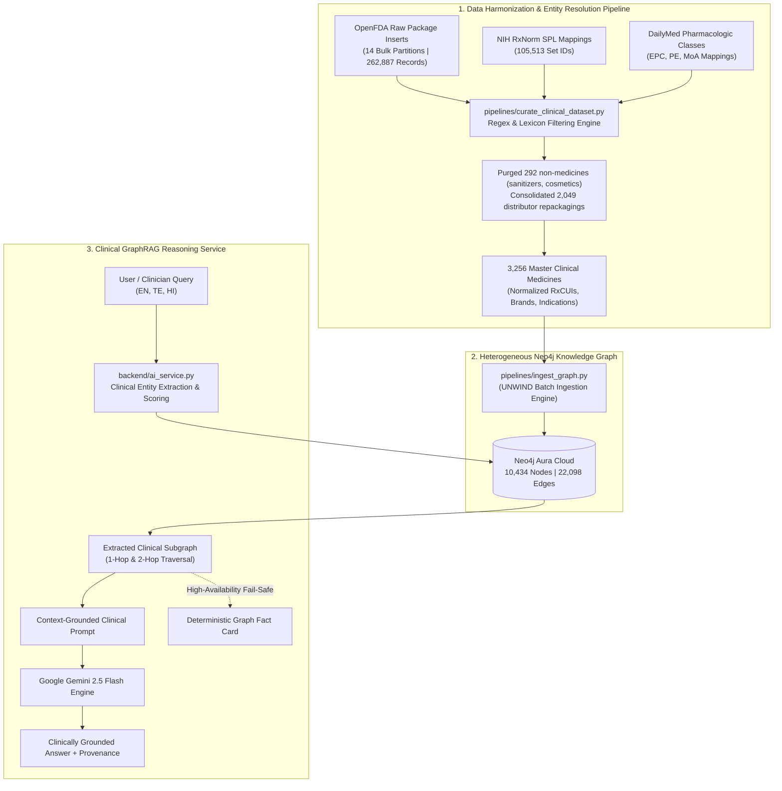
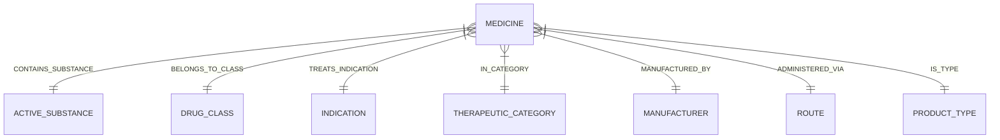

<div align="center">

# ⚕️ MedGraph Nexus
### *Production-Grade Clinical Knowledge Graph & Neuro-Symbolic GraphRAG System*

[](https://neo4j.com/)
[](https://deepmind.google/)
[](https://fastapi.tiangolo.com/)
[](https://www.python.org/)
[](https://open.fda.gov/)
[](#-multilingual-clinical-support)
[](#-fail-safe-deterministic-fallback)
[](LICENSE)

<p align="center">
  <b>A clinical decision-support and search engine that eliminates generative AI hallucinations by grounding clinical queries in a 10,434-node heterogeneous Neo4j Knowledge Graph.</b>
</p>

</div>

---

## 📖 Overview

**MedGraph Nexus** is a next-generation clinical reasoning platform designed to query, reason over, and visualize complex pharmaceutical knowledge. Built on a **curated knowledge graph of 10,434 nodes and 22,098 biological/pharmacological relationships**, MedGraph Nexus enables clinicians, researchers, and patients to explore medicine classifications, active chemical substances, therapeutic categories, adverse warnings, and mechanism-based alternative treatments in **English, Telugu, and Hindi**.

### The Core Problem It Solves: Eliminating Clinical Hallucinations
When standard generative LLMs (or traditional Vector RAG systems) answer complex medical queries, they predict words based on statistical token probabilities. In healthcare, hallucinating a drug interaction or active chemical ingredient can be catastrophic.

**MedGraph Nexus solves this through Neuro-Symbolic GraphRAG**:
1. **Symbolic Ground Truth**: The **Neo4j Knowledge Graph** enforces explicit, verifiable biological facts (active substances, drug classes, indications).
2. **Generative Reasoning**: **Google Gemini 2.5 Flash** synthesizes natural, multi-lingual explanations grounded strictly within the retrieved graph subgraphs.
3. **Deterministic Provenance**: Every clinical statement is directly traceable to official regulatory package inserts from the **U.S. FDA**, **NIH RxNorm**, and **DailyMed**.

> [!NOTE]
> For an in-depth technical analysis and defense of MedGraph's Applied AI/ML architecture, read the **[Comprehensive AI/ML Project Specification](docs/EXPERT_AIML_PROJECT_OVERVIEW.md)**.

---

## 🏗️ System Architecture


```mermaid
flowchart TD
    subgraph Data_Pipeline["1. Data Harmonization & Entity Resolution Pipeline"]
        FDA["OpenFDA Raw Package Inserts<br/>(14 Bulk Partitions | 262,887 Records)"] --> Curate["pipelines/curate_clinical_dataset.py<br/>Regex & Lexicon Filtering Engine"]
        RxNorm["NIH RxNorm SPL Mappings<br/>(105,513 Set IDs)"] --> Curate
        DMed["DailyMed Pharmacologic Classes<br/>(EPC, PE, MoA Mappings)"] --> Curate
        Curate --> Clean["Purged 292 non-medicines (sanitizers, cosmetics)<br/>Consolidated 2,049 distributor repackagings"]
        Clean --> Master["3,256 Master Clinical Medicines<br/>(Normalized RxCUIs, Brands, Indications)"]
    end

    subgraph KG["2. Heterogeneous Neo4j Knowledge Graph"]
        Master --> Ingest["pipelines/ingest_graph.py<br/>(UNWIND Batch Ingestion Engine)"]
        Ingest --> Graph[("Neo4j Aura Cloud<br/>10,434 Nodes | 22,098 Edges")]
    end

    subgraph RAG["3. Clinical GraphRAG Reasoning Service"]
        User["User / Clinician Query<br/>(EN, TE, HI)"] --> Extractor["backend/ai_service.py<br/>Clinical Entity Extraction & Scoring"]
        Extractor --> Graph
        Graph --> Subgraph["Extracted Clinical Subgraph<br/>(1-Hop & 2-Hop Traversal)"]
        Subgraph --> Prompt["Context-Grounded Clinical Prompt"]
        Prompt --> LLM["Google Gemini 2.5 Flash Engine"]
        LLM --> Response["Clinically Grounded Answer + Provenance"]
        Subgraph -.->|"High-Availability Fail-Safe"| Fallback["Deterministic Graph Fact Card"]
    end
```

---

## 🏥 Real-World Clinical Use Cases

| Clinical Scenario | The Problem with Standard AI | How MedGraph Nexus Solves It |
| :--- | :--- | :--- |
| **Alternative Drug Discovery** | Recommends random drugs without verifying cross-class contraindications. | Traverses `(:Medicine)-[:TREATS_INDICATION]->(:Indication)` and filters by `(:DrugClass)` to find true pharmacological substitutes (e.g., finding ARBs for patients with ACE-inhibitor cough). |
| **Brand Name Unmasking & Overdose Prevention** | Fails to recognize that different commercial trade names share the identical chemical entity. | Traverses both trade names to a single canonical `(:ActiveSubstance)` node, alerting the user to accidental double-dosing. |
| **Off-Label & Pharmacologic Exploration** | Hallucinates approved indications or combines conflicting drug labels. | Navigates the entire class sub-network deterministically, synthesizing approved indications across all sibling molecules. |

---

## 📊 Knowledge Graph Schema & Statistics

The production graph is hosted on **Neo4j Aura Cloud**, structured across 7 distinct node labels and 7 directed relationship types:

<div align="center">

| Metric | Count | Description |
| :--- | :---: | :--- |
| **Total Graph Nodes** | **10,434** | Interconnected clinical entities in Neo4j Aura |
| **Total Graph Relationships** | **22,098** | Strongly typed semantic and biological edges |
| **Verified Master Medicines** | **3,191** | Canonical clinical drugs consolidated from 3,256 curated records |
| **Active Chemical Substances** | **2,362** | Unique active pharmaceutical ingredients (APIs) |
| **Pharmacologic Drug Classes** | **468** | Mechanisms of action (Beta-Blockers, Statins, SSRIs, etc.) |
| **Medical Indications** | **3,136** | Approved symptoms and clinical conditions |
| **Therapeutic Categories** | **14** | Top-level specialties (Cardiovascular, Oncology, CNS, etc.) |
| **Sanitizers / Cosmetics** | **0** | 100% clinically sanitized and filtered |

</div>

### Graph Schema Model

```mermaid
erDiagram
    MEDICINE }|--|| ACTIVE_SUBSTANCE : CONTAINS_SUBSTANCE
    MEDICINE }|--|| DRUG_CLASS : BELONGS_TO_CLASS
    MEDICINE }|--|| INDICATION : TREATS_INDICATION
    MEDICINE }|--|| THERAPEUTIC_CATEGORY : IN_CATEGORY
    MEDICINE }|--|| MANUFACTURER : MANUFACTURED_BY
    MEDICINE }|--|| ROUTE : ADMINISTERED_VIA
    MEDICINE }|--|| PRODUCT_TYPE : IS_TYPE
```

---

## 📁 Repository Structure

```
medgraph/
├── backend/                       # Python FastAPI & Knowledge Graph RAG Service
│   ├── ai_service.py              # FastAPI HTTP server & Gemini 2.5 GraphRAG engine
│   ├── requirements.txt           # Python backend dependencies
│   └── Procfile                   # Cloud deployment configuration
├── frontend/                      # Web User Interface
│   └── index.html                 # Single-page Doctor AI clinical chatbot interface
├── pipelines/                     # Data Harmonization & Graph Ingestion Engines
│   ├── build_full_clinical_graph.py  # Bulk 14-partition OpenFDA & RxNorm harvester
│   ├── curate_clinical_dataset.py    # Non-drug purge & entity deduplication engine
│   ├── ingest_graph.py               # Neo4j Aura batch UNWIND loader
│   └── fetch_openfda.py              # OpenFDA REST API connector
├── docs/                          # Architecture & Scientific Documentation
│   └── EXPERT_AIML_PROJECT_OVERVIEW.md # Comprehensive AI/ML evaluation & thesis
├── data/                          # (Local / Git-Ignored) Raw archives & JSON datasets
├── .env.example                   # Environment configuration template
├── .gitignore                     # Production Git ignore rules (strictly excludes data)
└── README.md                      # Primary project documentation
```

---

## ⚡ Quickstart & Installation

### Prerequisites
- **Python**: 3.10 or higher
- **Neo4j AuraDB**: Free cloud instance or local Neo4j instance
- **Google Gemini API Key**: [Google AI Studio](https://aistudio.google.com/)

### 1. Clone the Repository
```bash
git clone https://github.com/your-username/medgraph.git
cd medgraph
```

### 2. Configure Environment Variables
Copy the template `.env.example` into `.env` (or `backend/.env`):
```bash
cp .env.example .env
```
Fill in your credentials:
```env
NEO4J_URI=neo4j+s://your-instance-id.databases.neo4j.io
NEO4J_USER=neo4j
NEO4J_PASSWORD=your_neo4j_password
GEMINI_API_KEY=your_gemini_api_key
```

### 3. Install Dependencies
```bash
pip install -r backend/requirements.txt
```

### 4. Start the GraphRAG Backend Service
```bash
cd backend
python -m uvicorn ai_service:app --host 127.0.0.1 --port 8000 --reload
```
The FastAPI service will initialize the Neo4j driver and Gemini 2.5 Flash model:
- **Interactive API Docs (Swagger UI)**: `http://localhost:8000/docs`
- **Healthcheck & Graph Statistics**: `http://localhost:8000/`

### 5. Launch the Frontend
Open `frontend/index.html` directly in any modern web browser or serve it via a local static server:
```bash
# Optional static server:
python -m http.server 3000 --directory frontend
```
Navigate to `http://localhost:3000` to interact with the **Doctor AI** assistant.

---

## 🌐 Multilingual Clinical Support

MedGraph Nexus natively supports clinical queries across three languages:
- **English**: Standard international pharmacopeia terminology.
- **తెలుగు (Telugu)**: Native regional Telugu medical inquiries with phonetically normalized symptom matching.
- **हिन्दी (Hindi)**: Hindi clinical queries with Devanagari script processing.

The reasoning agent preserves medical substance integrity across translations, ensuring drug names and active molecules remain standard while conversational guidance adapts to the user's native language.

---

## 🛡️ Fail-Safe Deterministic Fallback

In high-stakes clinical domains, an AI system cannot crash or output generic error messages when third-party LLM APIs face rate limits or latency ceilings.

MedGraph includes an integrated **High-Availability Graph Fallback**:
- If Gemini 2.5 Flash encounters a rate limit (HTTP 429) or network timeout, the backend catches the exception and immediately constructs a **Deterministic Graph Fact Card** directly from the retrieved Neo4j nodes.
- The user receives verified active substances, indications, warnings, and drug classes with zero latency and **zero hallucination risk**.

---

## 🔬 Running Data Harmonization (Optional)

To rebuild or curate the dataset from raw federal archives:

1. **Extract and Harmonize Master Medicines**:
   ```bash
   python pipelines/curate_clinical_dataset.py
   ```
   *Purges cosmetic/sanitizer records and deduplicates repackaged medicines into `data/medicine_dataset.json`.*

2. **Batch-Ingest into Neo4j**:
   ```bash
   python pipelines/ingest_graph.py
   ```
   *Executes parameterized UNWIND Cypher batches with uniqueness constraints and full-text indexes.*

---

## 📜 License

This project is licensed under the **MIT License** — see the [LICENSE](LICENSE) file for details.

---

<div align="center">
  <b>Built with ❤️ for precision clinical medicine, explainable AI, and patient safety.</b>
</div>
