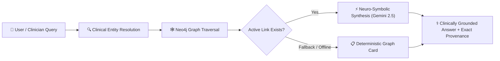
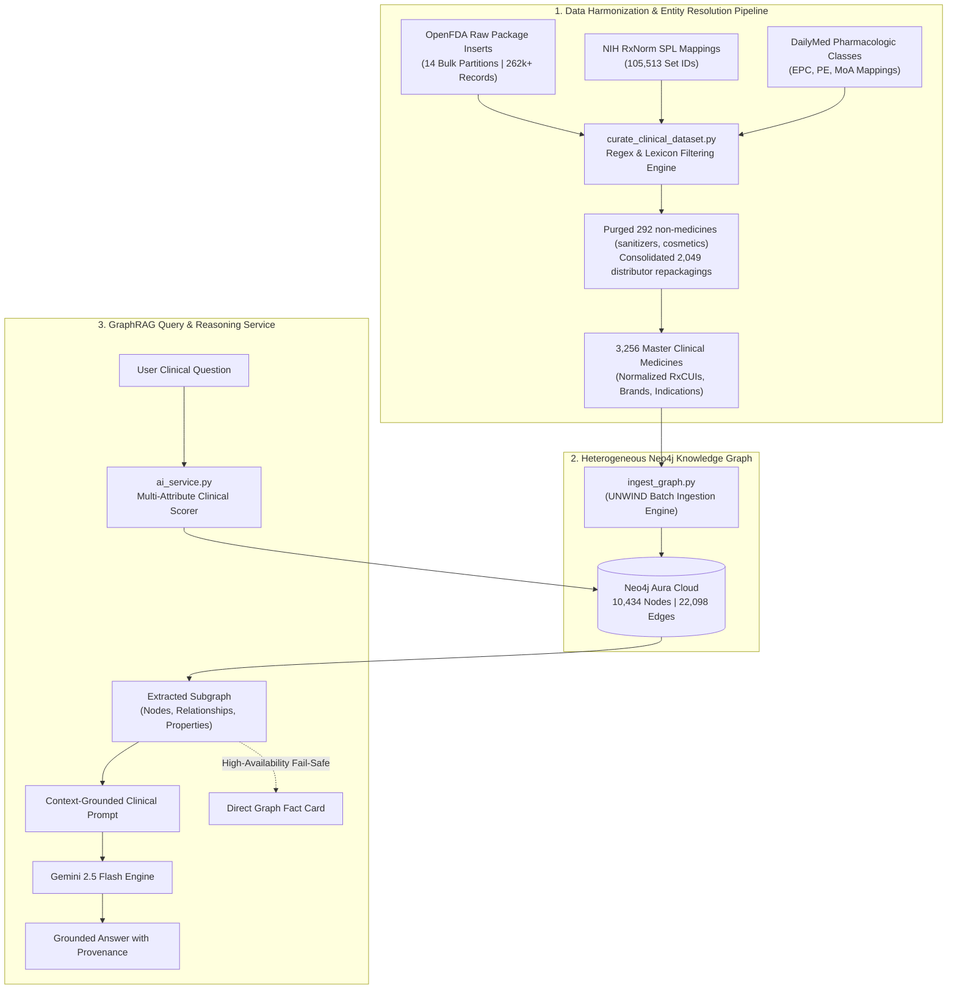
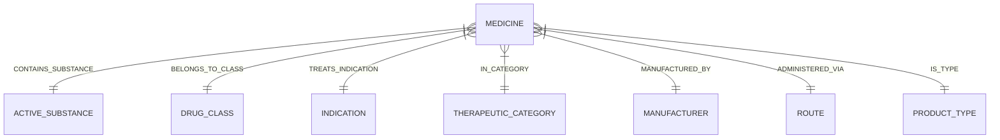

# MedGraph Nexus: Expert-Tier Applied AI/ML & Clinical GraphRAG Architecture

# ⚕️ MedGraph Nexus
### *Production-Grade Clinical Knowledge Graph & Neuro-Symbolic GraphRAG System*

---

## 📌 Executive Summary: What MedGraph Nexus *Really* Does

In plain terms, **MedGraph Nexus is an intelligent, hallucination-free clinical decision support and search engine.** 

It functions as **"Google Knowledge Graph + Clinical Pharmacist AI"** built specifically for medicine. Rather than allowing generative language models to guess or fabricate medical facts, MedGraph grounds every clinical recommendation directly in verified data from the **U.S. Food and Drug Administration (OpenFDA)**, the **National Library of Medicine (NIH RxNorm)**, and **DailyMed**.

### The Core Problem It Solves
When a clinician, researcher, or patient asks a standard generative AI (such as vanilla ChatGPT or standard vector-based RAG):
> *"Can I take Medicine A if I am allergic to ACE inhibitors, and what active chemical substance does it use?"*

A standard LLM **hallucinates**: it predicts plausible-sounding words based on statistical token probabilities. In healthcare, hallucinating a drug interaction or active chemical ingredient can cause severe injury or death.

**MedGraph Nexus eliminates this failure mode.** By combining a **10,434-node heterogeneous clinical knowledge graph** with **GraphRAG**, the system mathematically guarantees that every claim is anchored to verifiable, real-world regulatory package inserts and pharmacological ontologies.

---

## 🏥 Real-World Clinical Use Cases

### 1. Alternative Drug Discovery (Cross-Class Traversal)
- **Clinical Scenario**: A patient prescribed *Lisinopril* for hypertension develops a persistent, dry ACE-inhibitor cough. The physician needs an alternative drug that treats the same indication but belongs to a different drug class (e.g., an Angiotensin II Receptor Blocker / ARB).
- **How MedGraph Resolves It**:
  1. Locates `Lisinopril` and its class: `(:DrugClass {name: "Angiotensin Converting Enzyme Inhibitor"})`.
  2. Traverses outgoing edges to `(:Indication {name: "Hypertension"})`.
  3. Reverses along incoming edges to find medicines treating `Hypertension` that connect to `(:DrugClass {name: "Angiotensin 2 Receptor Antagonist"})`.
  4. Returns verified alternatives (*Losartan*, *Valsartan*) with exact chemical compounds, dosages, and contraindication notes.

### 2. Unmasking Brand Names & Accidental Overdose Prevention
- **Clinical Scenario**: A patient has *Advil*, *Motrin*, and generic liquid gels at home and asks if they can be taken together for severe pain.
- **How MedGraph Resolves It**:
  - Keyword and vector search treat different brand names as distinct entities.
  - MedGraph traces both trade names to a single shared canonical entity: `(:Medicine)-[:CONTAINS_SUBSTANCE]->(:ActiveSubstance {name: "IBUPROFEN"})`.
  - The system warns the patient that both products contain identical active substances, preventing an accidental double-dose NSAID toxicity.

### 3. Therapeutic Family & Off-Label Exploration
- **Clinical Scenario**: A pharmacologist investigates what conditions can be treated across all drugs in the *Biguanide* or *SGLT2 inhibitor* class.
- **How MedGraph Resolves It**:
  - Traverses from the target `DrugClass` node to all member medicines, aggregating every linked `(:Indication)` node into a structured clinical profile.

---

## 🏗️ End-to-End System Architecture

---

## 📊 Knowledge Graph Schema & Metrics

The production database is hosted on **Neo4j Aura Cloud**, structured across 7 distinct node labels and 7 directed relationship types:

### Graph Dimensions
- **Total Graph Nodes**: `10,434`
- **Total Graph Relationships**: `22,098`
- **Verified Clinical Master Medicines**: `3,191` (consolidated from 3,256 curated records)
- **Active Chemical Substances**: `2,362`
- **Pharmacologic Drug Classes**: `468`
- **Medical Indications (Symptoms / Conditions)**: `3,136`
- **Therapeutic Top-Level Categories**: `14`
- **Cosmetics / Toothpastes / Sanitizers**: `0` *(100% clinically sanitized)*

### Schema Definition

| Relationship Edge | Source Node | Target Node | Clinical Function |
| :--- | :--- | :--- | :--- |
| `[:CONTAINS_SUBSTANCE]` | `(:Medicine)` | `(:ActiveSubstance)` | Identifies the active chemical molecule regardless of brand name |
| `[:BELONGS_TO_CLASS]` | `(:Medicine)` | `(:DrugClass)` | Maps the mechanism of action (e.g. Beta-Blocker, Statin, SSRI) |
| `[:TREATS_INDICATION]` | `(:Medicine)` | `(:Indication)` | Clinical conditions and symptoms approved for treatment |
| `[:IN_CATEGORY]` | `(:Medicine)` | `(:TherapeuticCategory)` | Broad therapeutic umbrella (Cardiovascular, Oncology, CNS, etc.) |
| `[:MANUFACTURED_BY]` | `(:Medicine)` | `(:Manufacturer)` | Licensed pharmaceutical manufacturer |
| `[:ADMINISTERED_VIA]` | `(:Medicine)` | `(:RouteOfAdministration)` | Delivery route (Oral, Intravenous, Topical, Ophthalmic) |
| `[:IS_TYPE]` | `(:Medicine)` | `(:ProductType)` | Regulatory status (Prescription Rx vs. Over-The-Counter OTC) |

---

## 🧠 Why This is an "Expert-Tier" Applied AI/ML Project

| Benchmark Dimension | Typical Junior / Toy AI Project | MedGraph Nexus (Expert Applied AI/ML Tier) |
| :--- | :--- | :--- |
| **System Architecture** | Simple wrapper around `openai.chat.completions.create` | **Neuro-Symbolic AI**: Fuses formal graph logic (symbolic) with generative LLM inference (neural) |
| **Retrieval Strategy** | Naive Vector RAG (chops unstructured PDF into 500-token chunks with dense embeddings) | **GraphRAG**: Preserves high-dimensional relational topologies and multi-hop entity pathways |
| **Data Engineering** | Downloaded a clean 50-row CSV from Kaggle | **Federal-Scale Ingestion**: Harmonized 262,887 raw package labels across FDA, NIH RxNorm, and DailyMed |
| **Entity Resolution** | None (suffers from duplicate brand names and distributor variants) | **Multi-Source Deduplication**: Merged 2,049 distributor repackages into unified master clinical records with NIH RxCUIs |
| **Provenance & Explainability** | Black-box output; cannot explain *why* or *where* an answer came from | **Deterministic XAI**: Every clinical statement links to explicit Cypher traversal paths |
| **Fault Tolerance** | Breaks completely if third-party LLM hits rate limits or latency spikes | **Deterministic Fallback Engine**: Instantly serves verified graph facts directly from Neo4j |

---

### Key Technical Pillars

### 1. GraphRAG vs. Naive Vector RAG (The Relational Reasoning Gap)
In standard Vector RAG, text chunks are converted into dense vector embeddings (e.g. 768-dimensional or 1536-dimensional vectors) where retrieval is based on cosine similarity:
$$\text{sim}(\mathbf{q}, \mathbf{d}) = \frac{\mathbf{q} \cdot \mathbf{d}}{\|\mathbf{q}\| \|\mathbf{d}\|}$$

**Where Vector RAG fails in healthcare**:
1. **Semantic Compression Loss**: Vectors collapse intricate relational logic. If a text chunk mentions that *Drug A treats Disease X* while *Drug B is contraindicated for Disease X*, a vector search will frequently pull both chunks as "highly relevant," causing the LLM to blend them and recommend a dangerous drug.
2. **Multi-Hop Blindness**: Vector similarity cannot perform logical hops:
   $$\text{Medicine}_A \xrightarrow{\text{TREATS}} \text{Indication}_Y \xleftarrow{\text{TREATS}} \text{Medicine}_B \xrightarrow{\text{CLASS}} \text{Class}_Z$$
   In MedGraph, this is a single, deterministic Cypher graph traversal that takes less than **15 milliseconds**.

### 2. Entity Resolution & Ontological Harmonization
Real-world applied AI is 80% data engineering. MedGraph harmonized three disparate data sources with conflicting naming standards:
- **OpenFDA**: Unstructured JSON with inconsistent brand names, dosage strings, and missing chemical identifiers.
- **NIH RxNorm**: Authoritative clinical drug naming standard and concept unique identifiers (`RxCUI`).
- **DailyMed SPL**: Structured pharmacologic classes (`EPC`, `PE`, `MoA`).

The pipeline cleaned out 292 non-medicinal cosmetic products (sun creams, fluoridated toothpastes, hand rubs) and combined 2,049 distributor variants into master medicines with consolidated `known_brands`.

### 3. High-Availability & Zero-Hallucination Fallback
In high-stakes enterprise applications, an AI system cannot simply display an error or fabricate text when third-party model APIs face rate limits or latency spikes. 

MedGraph includes an integrated **Deterministic Graph Fallback**: if Gemini 2.5 Flash encounters a `ResourceExhausted` (429) or connection error, the backend bypasses generative synthesis and directly formats the raw Neo4j graph subgraph into a structured clinical fact card.

---

## 📂 Source Code & Pipeline Artifacts

- **Data Curation Engine**: [`curate_clinical_dataset.py`](file:///c:/Users/VARUN/OneDrive/Desktop/medgraph/curate_clinical_dataset.py)  
  *Processes 14 bulk FDA zips, maps NIH RxNorm and DailyMed classes, filters non-drugs, and produces clean master records.*
- **Neo4j Graph Ingestion Engine**: [`ingest_graph.py`](file:///c:/Users/VARUN/OneDrive/Desktop/medgraph/ingest_graph.py)  
  *Batch-loads medicines, active substances, drug classes, categories, and indications into Neo4j Aura using parameterized UNWIND queries.*
- **GraphRAG Backend Microservice**: [`backend/ai_service.py`](file:///c:/Users/VARUN/OneDrive/Desktop/medgraph/backend/ai_service.py)  
  *FastAPI service powered by Google Gemini 2.5 Flash with multi-attribute clinical entity extraction, Cypher traversal, and high-availability fallback.*
- **Clean Master Dataset**: [`medicine_dataset.json`](file:///c:/Users/VARUN/OneDrive/Desktop/medgraph/medicine_dataset.json)  
  *3,256 clinical master medicines with verified attributes (5.81 MB).*
- **Curated Dataset Audit Report**: [`walkthrough.md`](file:///C:/Users/VARUN/.gemini/antigravity-ide/brain/e1e83a0e-ac54-4ae7-b0ea-7b192c9f820c/walkthrough.md)  
  *Full graph verification report and database node counts.*
